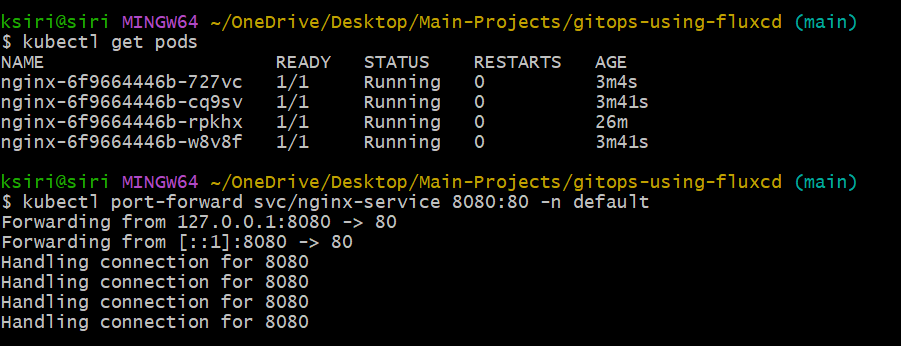
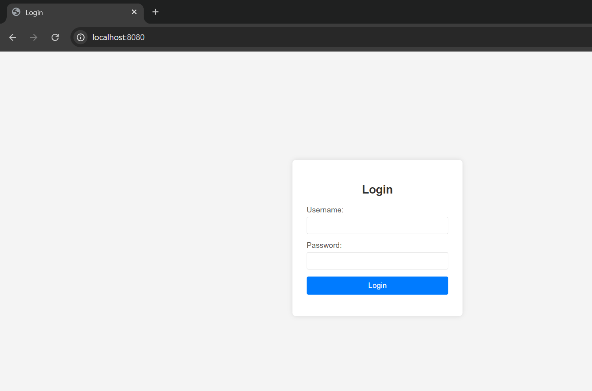
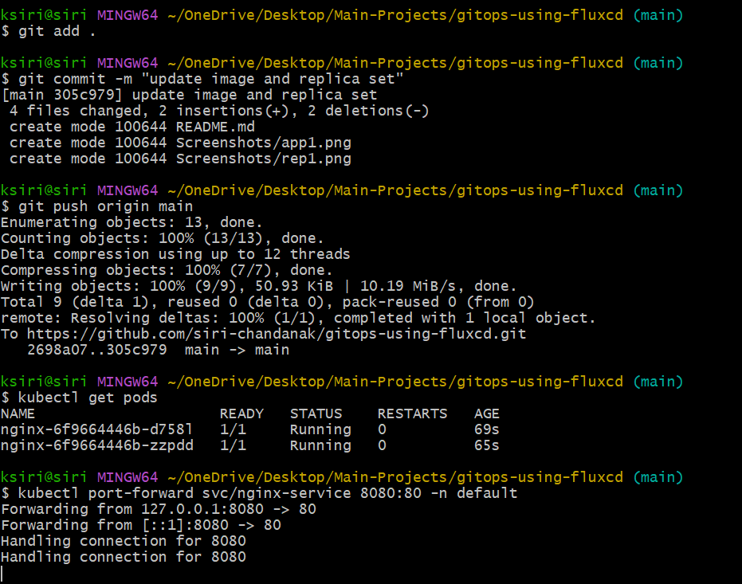
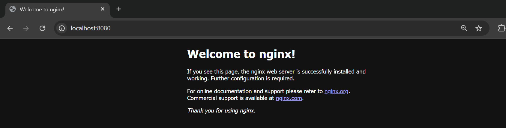

# GitOps-Based Continuous Deployment Using FluxCD

This repository demonstrates a GitOps-based continuous deployment setup using FluxCD. It includes configurations for deploying an Nginx application on a Kubernetes cluster, managed through Git.


## Table of Contents

- [Project Overview](#project-overview)  
- [Prerequisites](#prerequisites)  
- [Repository Structure](#repository-structure)  
- [FluxCD Installation](#fluxcd-installation)  
- [Deploying the Application](#deploying-the-application)  
- [Testing GitOps Functionality](#testing-gitops-functionality)  
- [Accessing Nginx](#accessing-nginx)  


## Project Overview

- Implements **GitOps workflow** using FluxCD.
- Automatically deploys manifests from Git to Kubernetes.
- Supports **automatic reconciliation**, ensuring cluster state matches Git repository.
- Demo application: **Nginx** Deployment and Service.

## Prerequisites

- Kubernetes cluster (Kind, K3s, Minikube, or cloud cluster) - I used KIND
- kubectl CLI installed and configured
- Git installed
- FluxCD CLI installed

## Repository Structure

```
.
├── apps
│   └── nginx
│       ├── kustomization.yaml
│       └── deployment.yaml
└── clusters
    └── my-cluster
        └── flux-system
            ├── gotk-components.yaml
            └── gotk-sync.yaml
            └── kustomization.yaml
```


- `apps/nginx/` – contains application manifests.  
- `clusters/my-cluster/flux-system/` – contains FluxCD manifests and Kustomizations. Automatically created by FluxCD CLI and we need to update kustomization.yaml to include our application.

## FluxCD Installation
1. Install FluxCD CLI:
   ```bash
   brew install fluxcd/tap/flux
   ```
2. Bootstrap FluxCD in your cluster:
   ```bash
   flux bootstrap github \
     --owner=$GITHUB_USER \
     --repository=$GITHUB_REPO \
     --branch=$GITHUB_BRANCH \
     --path=clusters/my-cluster/flux-system \
        --personal
    ```
   Replace `$GITHUB_USER`, `$GITHUB_REPO`, and `$GITHUB_BRANCH` with your GitHub username, repository name, and branch name respectively.
3. Verify FluxCD installation:
   ```bash
   flux version
   kubectl get pods -n flux-system
   ```  

## Deploying the Application
1. Ensure `apps/nginx/deployment.yaml` and `apps/nginx/service.yaml` exist in Git.
2. Apply kustomization to include the Nginx app:
   ```yaml
   apiVersion: kustomize.config.k8s.io/v1beta1
   kind: Kustomization
   resources:
     - ../../apps/nginx
   ```
3. Commit and push changes to Git:
   ```bash
   git add .
   git commit -m "Add Nginx deployment"
   git push
   ```
4. FluxCD will automatically sync and deploy the Nginx application to the cluster.

## Testing GitOps Functionality
1. Make a change to the Nginx deployment (e.g., update the image tag).
2. Commit and push the changes to Git.
3. Verify that FluxCD detects the changes and updates the deployment in the cluster.
4. Check the status of the deployment:
   ```bash
   kubectl get deployments -n default
   ```
## Accessing Nginx
1. Forward the Nginx service port to your local machine:
   ```bash
   kubectl port-forward svc/nginx-service 8080:80
   ```
2. Access Nginx in your browser at `http://localhost:8080`.
3. You should see the Nginx welcome page.

---

## Demo

Initially, replicas were set to 4 and image to `siri019/simple-html-login-page:v1.1`.


    
After updating replicas to 2 and image to `nginx:latest`, FluxCD automatically reconciled the changes.




## Future Enhancements
- Integrate with CI/CD pipelines for automated testing.
- Add monitoring and alerting for deployments.
- Explore advanced FluxCD features like image automation and notifications.